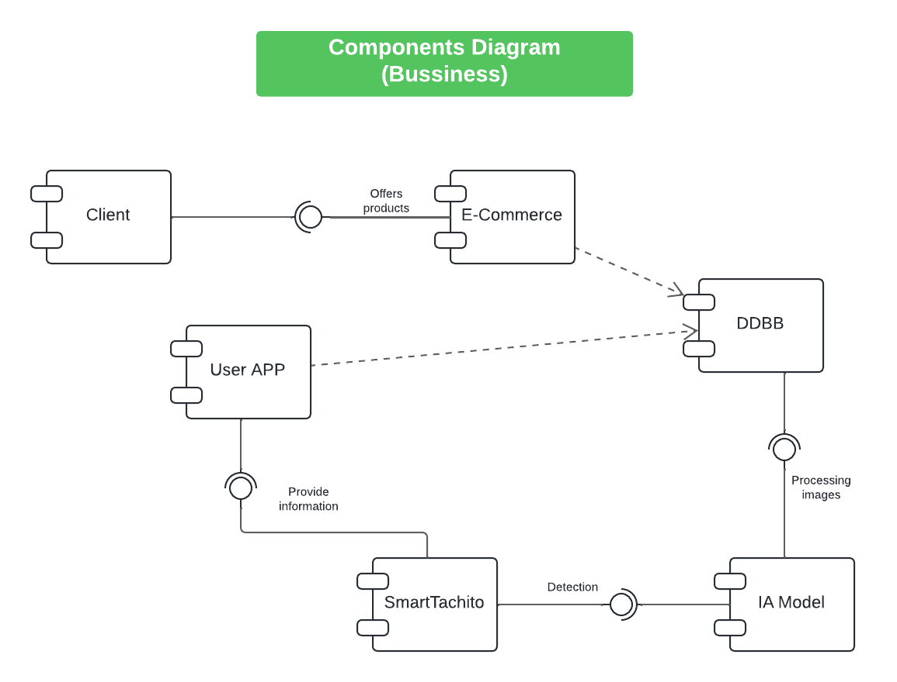

# Diagrams
## HDL (High Level Diagram)

## Components Diagrams
### Bussiness

# Tecnologías para este proyecto
## Control de versiones
- Git - v2.44.0
- Github - v3.12.2
    - Videos
        - [Pildoras informaticas (11 videos)] (https://www.youtube.com/watch?v=ANF1X42_ae4&list=PLU8oAlHdN5BlyaPFiNQcV0xDqy0eR35aU/)
        - [FreeCodeCamp] (https://www.youtube.com/watch?v=h2ZzlNVl-nI)
    - Páginas
        - [Página oficial] (https://git-scm.com/)
        - [Documentación oficial] (https://git-scm.com/docs)

## DBMS (Data Base Management System)
- MySQL
- MongoDB

## Frontend
- Figma (UX / UI)
- Bootstrap - v5.2.x
- AngularJS - v16.0.x

## Backend
- Django - v5.0.4
- Django Rest Framework - v3.15.1
- Django jazzmin - v3.0.0
- Django cors headers - v4.3.1

## SQA & QA
- Postman
- Selenium

## Deployment
- DigitalOcean (backend)
- Netify (frontend)
- Google Play Store (Android app)
- App Store (IOS app)
