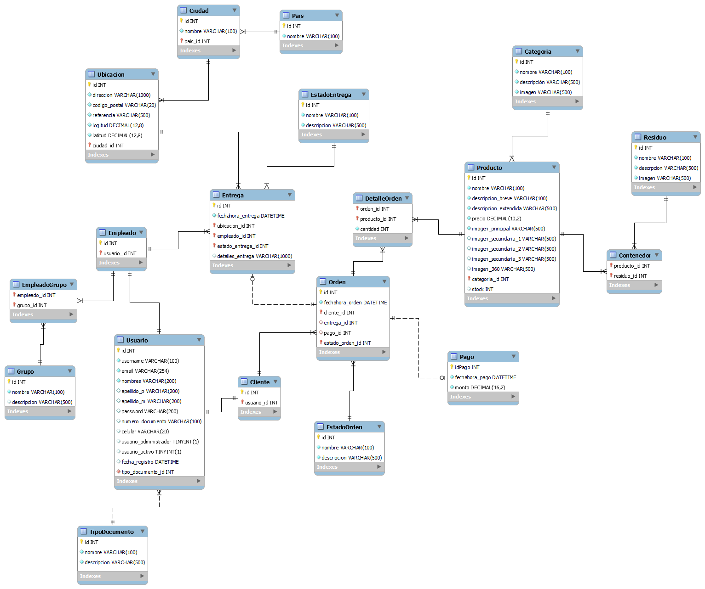

# Modelo Físico

## Diccionario de datos
A continuación se presenta el diccionario de datos de las tablas del modelo físico de la BBDD

### Usuario
| Campo | Tipo de dato | Tamaño | Formato | PK | FK | NN | AI | Default | Descripción |
| ----- | ------------ | ------ | ------- | --- | --- | --- | --- | ------- | ----------- |
| idUsuario | INT | - | - | SI | - | SI | SI | - | Identificador primario del usuario |
| Nombres | VARCHAR | 100 | - | - | - | SI | - | - | Nombres del usuario |
| ApellidoP | VARCHAR | 100 | - | - | - | SI | - | - | Apellido paterno del usuario |
| ApellidoM | VARCHAR | 100 | - | - | - | SI | - | - | Apellido materno del usuario |
| Email | VARCHAR | 100 | example@domain.com | - | - | SI | - | - | Email del usuario |
| Contrasenha | VARCHAR | 100 | - | - | - | SI | - | - | Contraseña del usuario |
| TipoDocumento | INT | - | - | - | - | SI | - | 1 | Tipo de documento: (1 - DNI) / (2 - Carnet de extranjería) |
| Documento | VARCHAR | 50 | - | - | - | SI | - | - | Nº de documento del usuario |
| Telefono | VARCHAR | 50 | - | - | - | SI | - | - | Nº de teléfono del usuario |

