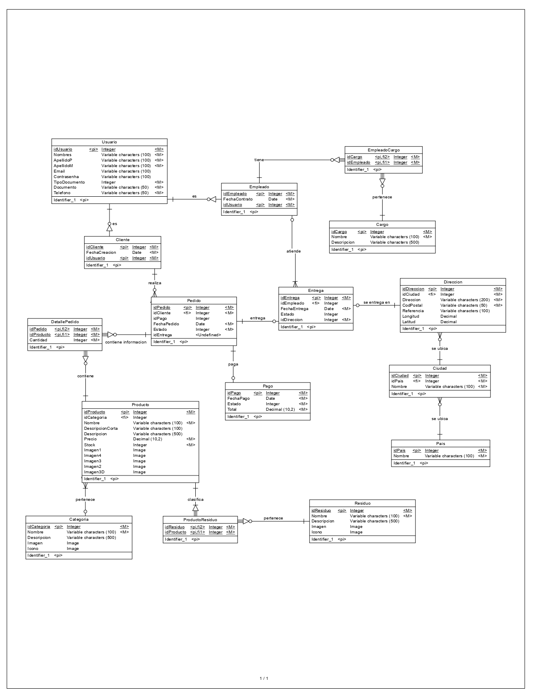

# Modelo Lógico

## Entidades

### Usuario
Tanto los clientes como los empleados tendrán asociado un usuario, el cuál les permitirá acceder a la plataforma. Por lo que es  necesaria una entidad Usuario
#### Atributos
| Atributo | Tipo de dato | Descripcion |
| -------- | ------------ | ----------- |
| idUsuario | integer | Identificador del usuario |
| Nombres | varchar(100) | Nombres del usuario |
| ApellidoP | varchar(100) | Apellido paterno del usuario |
| ApellidoM | varchar(100) | Apellido materno del usuario |
| Email | varchar(100) | Correo electrónico del usuario |
| Contrasenha | varchar(100) | Contraseña del usuario, la cual le permitirá acceder al panel de administración. Este campo debe estar encriptado |
|TipoDocumento | integer | Tipo de documento del usuario, el cual puede ser: 1 - DNI / 2 - Carnet de extranjería |
| Documento | varchar(50) | Numero del documento, el cual debe estar en base al tipo de documento registrado |
| Telefono | varchar(50) | Número telefónico del usuario, con el prefijo correspondiente |

### Empleado
El panel de administración permitirá gestionar información de los empleados, por lo que es necesaria una entidad Empleado
#### Atributos
| Atributo | Tipo de dato | Descripcion |
| -------- | ------------ | ----------- |
| idEmpleado | integer | Identificador del empleado |
| FechaContratacion | date | Fecha de contratación del empleado |
| idUsuario | integer | Identificador foráneo del usuario del empleado |

### Cliente
El panel de administración permitirá gestionar información de los cliente, por lo que es necesaria una entidad Cliente. A su vez, en la página del e-commerce se podrán registrar los clientes para realizar las respectivas compras.
#### Atributos
| Atributo | Tipo de dato | Descripcion |
| -------- | ------------ | ----------- |
| idCliente | integer | Identificador del cliente |
| FechaCreacion | date | Fecha de creacion del usuario del cliente |
| idUsuario | integer | Identificador foráneo del usuario del cliente |

### Cargo:
Cada empleado tiene uno o mas cargos, por lo que es necesaria una entidad Cargo. Se podrán gestionar los cargos a través del panel de administración
#### Atributos
| Atributo | Tipo de dato | Descripcion |
| -------- | ------------ | ----------- |
| idCargo | integer | Identificador del cargo |
| Nombre | varchar(100) | Nombre del cargo |
| Descripcion | varchar(500) | Descripción del cargo |

### EmpleadoCargo
Tabla intermedia entre Empleado y Cargo
#### Atributos
| Atributo | Tipo de dato | Descripcion |
| -------- | ------------ | ----------- |
| idCargo | integer | Identificador del cargo |
| idEmpleado | integer | Identificador del empleado |

